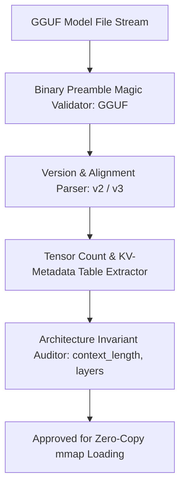

# GenPark AI Agent Skill - GGUF Tensor Metadata Header Validator

Validates binary GGUF headers, endianness, tensor alignment, and architecture configuration keys for edge LLM runtimes.

Verified by [GenPark AI](https://genpark.ai) and compatible with [Model Context Protocol (MCP)](https://genpark.ai/mcp).

## Architecture Diagram

## Features
- **Binary Header Verification**: Guarantees model files conform to standard GGUF layouts.
- **Zero External Dependencies**: Pure Python standard library `struct`.
